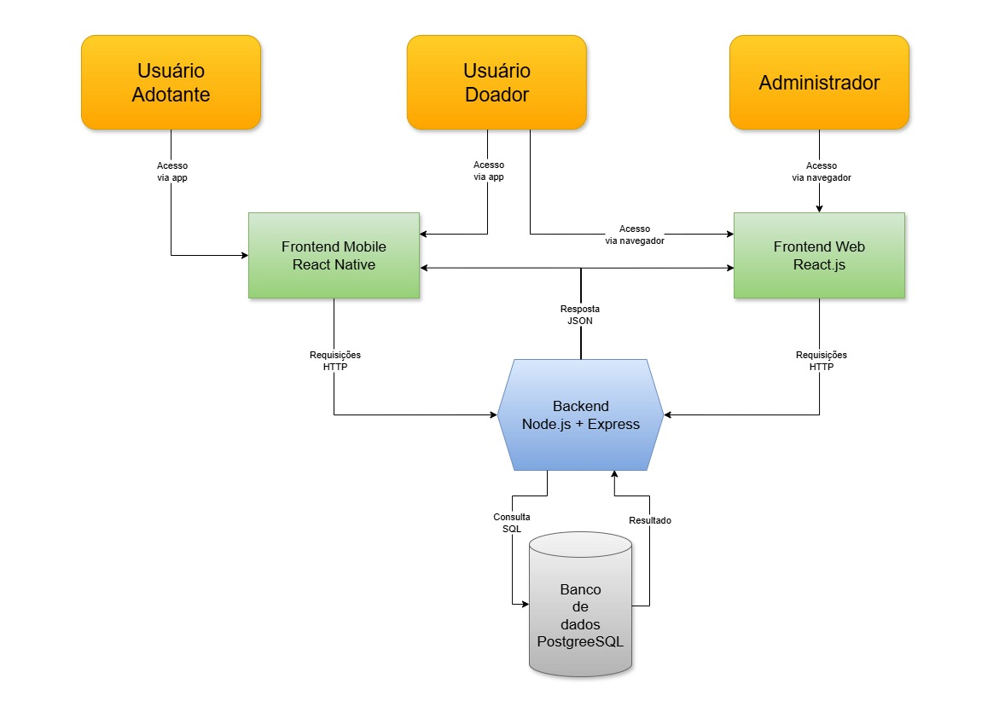
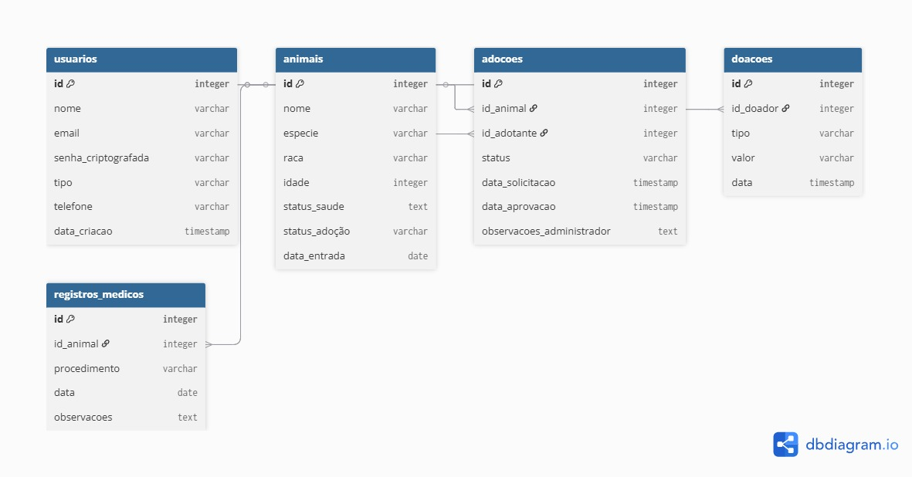
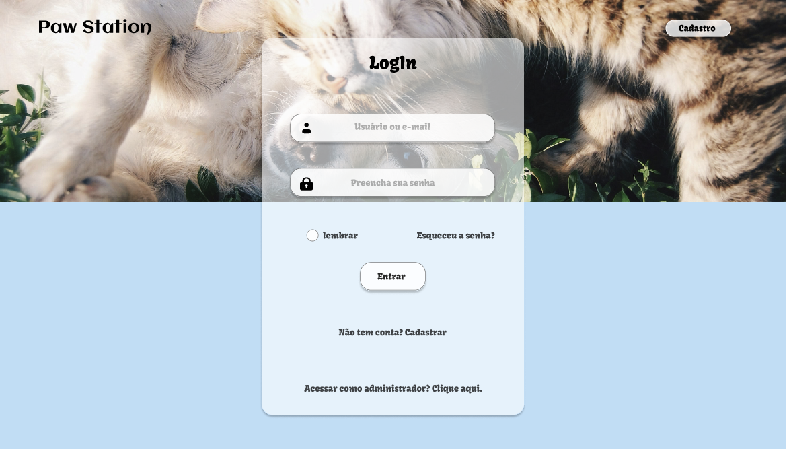
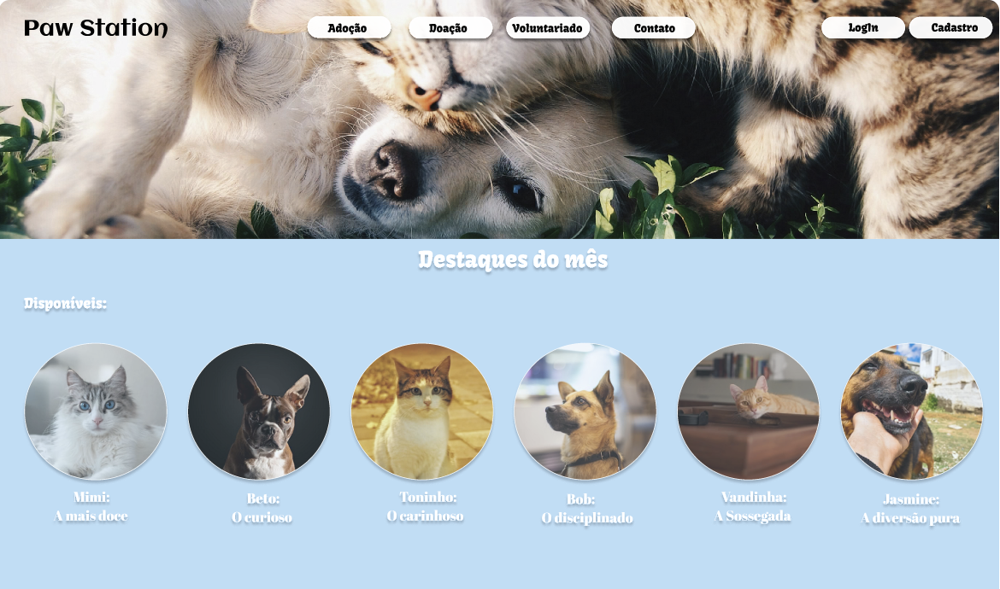
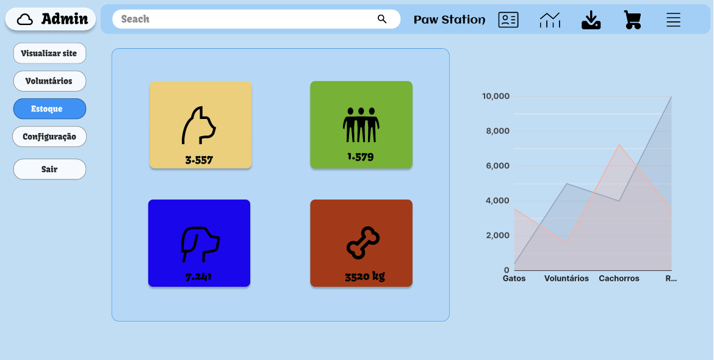
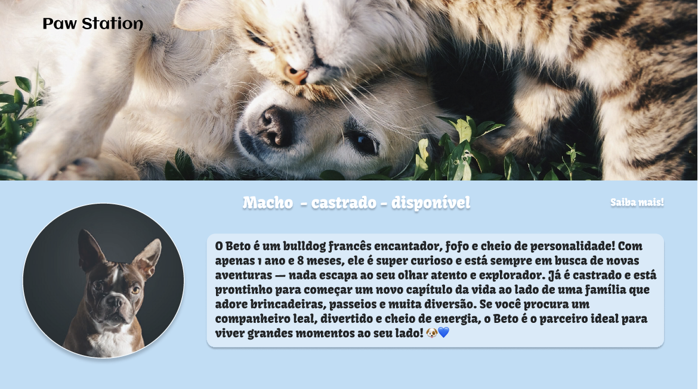
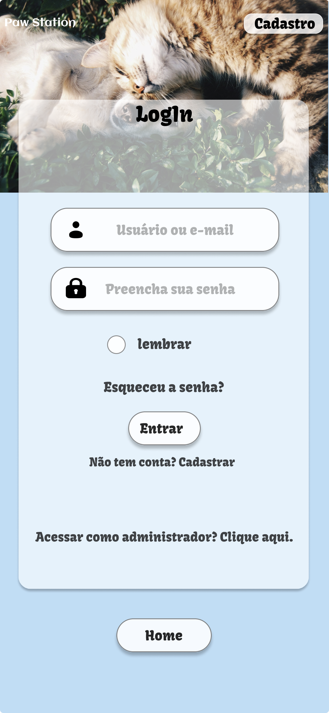
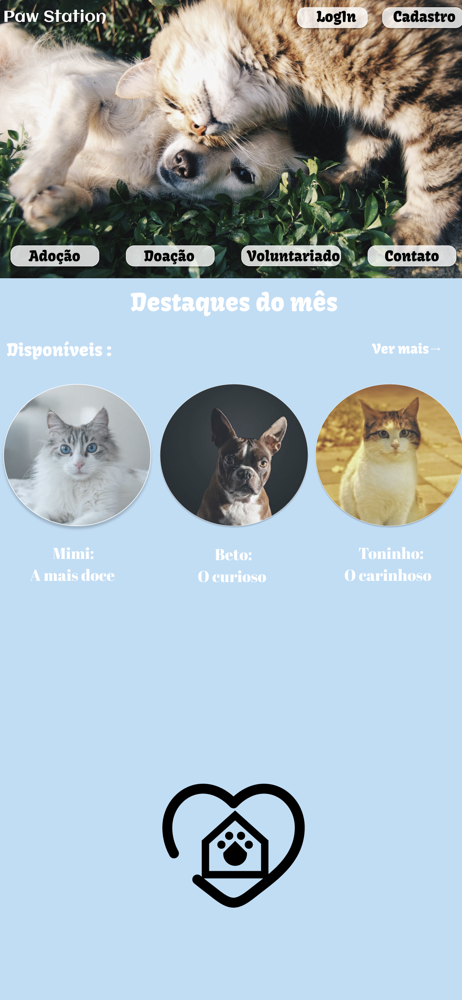
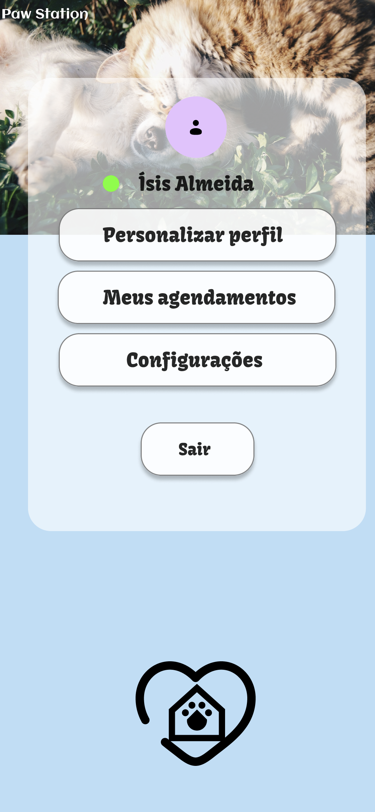
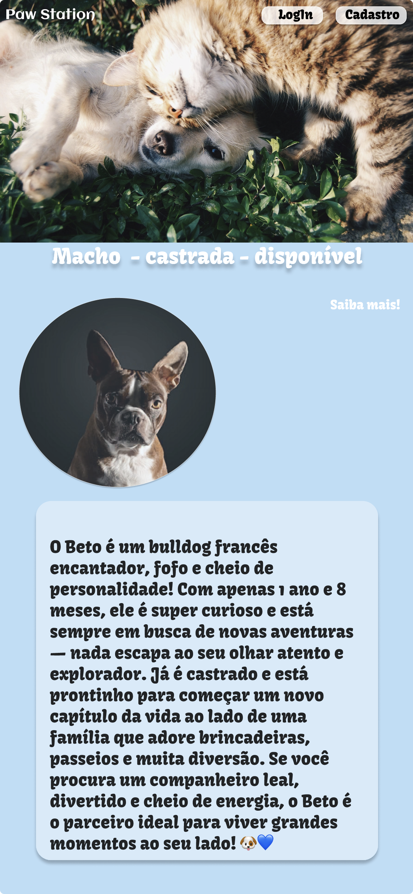

# Paw Station
Solução digital para gestão de abrigos de animais. 
Conecta voluntários, adotantes e doadores em uma plataforma unificada.

## Contexto Acadêmico
Projeto desenvolvido para o curso de *Análise e Desenvolvimento de Sistemas* da *Unifor, na disciplina **N705 – Projeto Aplicado Multiplataforma*, etapa 1.

## Problema Abordado e Justificativa
A gestão de abrigos de animais, como os localizados no Campus Humanidades II da UFC, é realizada majoritariamente de forma manual, envolvendo planilhas, redes sociais e comunicação por mensagens. Isso leva a processos ineficientes, falta de transparência nas doações, dificuldade em gerenciar o histórico de saúde dos animais e acompanhar adoções. Este sistema visa digitalizar e otimizar esses processos, liberando tempo para os voluntários cuidarem dos animais.

## Objetivos do Sistema
- Centralizar e facilitar o gerenciamento de animais, adoções, doações e voluntários
- Aumentar a transparência para doadores e adotantes
- Melhorar a eficiência operacional do abrigo, reduzindo tempo gasto com tarefas manuais
- Promover adoções responsáveis através de um processo acompanhado

## Escopo do Projeto
O sistema contemplará os seguintes módulos principais:
- *Autenticação e Autorização de Usuários*
- *Cadastro e Gestão do Perfil de Animais*
- *Processo de Adoção* (Solicitação, Aprovação, Acompanhamento)
- *Gestão de Doações* (Financeiras e Materiais)
- *Controle de Voluntários e Escalas de Trabalho* - *Controle de Estoque* (Ração, Medicamentos, Itens de Higiene)
- *Geração de Relatórios e Dashboard com Métricas*

## Visão Geral da Arquitetura
O sistema seguirá uma arquitetura baseada em microsserviços, separando a lógica de negócio em serviços independentes para melhor escalabilidade e manutenção.

## Diagrama de Arquitetura
O diagrama abaixo ilustra a interação entre os componentes:

## Diagrama Entidade-Relacionamento (ER)
O diagrama abaixo representa visualmente as entidades, seus atributos e relacionamentos.

## Tecnologias Propostas
- *Frontend Web:* React.js com TypeScript e Material UI
- *Mobile:* React Native com TypeScript
- *Backend:* Node.js (Express) ou Python (FastAPI)
- *Banco de Dados:* PostgreSQL (dados relacionais) + Firebase (para notificações push)
- *Autenticação:* JWT (JSON Web Tokens)
- *Cloud/Deploy:* AWS (EC2, RDS, S3) ou Heroku (para o MVP)
- *CI/CD:* GitHub Actions

## Protótipos Interativos

### Versão Mobile
[🔗 Clique para testar o protótipo mobile no Figma](https://www.figma.com/proto/cY5Wcg54bfTLGjR96yM798/PawStation?node-id=205-99&p=f&t=e6ijebA2PL6NBj3w-0&scaling=min-zoom&content-scaling=fixed&page-id=0%3A1&starting-point-node-id=205%3A40)

### Versão Web  
[🔗 Clique para testar o protótipo web no Figma](https://www.figma.com/proto/cY5Wcg54bfTLGjR96yM798/PawStation?node-id=93-977&p=f&t=JTE14MPkg1GYjdLb-0&scaling=min-zoom&content-scaling=fixed&page-id=64%3A238&starting-point-node-id=93%3A977&show-proto-sidebar=1)

## Cronograma para Etapa 2 (N708)
| Fase | Duração | Atividades Principais |
|------|---------|----------------------|
| *Planejamento Detalhado* | 2 semanas | Definir specs detalhadas, configurar ambientes de dev |
| *Desenvolvimento do Backend* | 4 semanas | Implementar APIs, models, autenticação e integrações |
| *Desenvolvimento do Frontend* | 5 semanas | Desenvolver interfaces web e mobile |
| *Testes e Integração* | 2 semanas | Testes de usabilidade, performance e segurança |
| *Implantação do MVP* | 1 semana | Deploy em ambiente de produção e validação final |
| *Total* | *14 semanas* | |

## Integrantes da Equipe e Papéis
| Nome | Matrícula | Papel Principal |
|------|-----------|-----------------|
| João Pedro Almeida Santos | 2327071 | Desenvolvedor Backend |
| Vivian Leigh Teixeira Salvi | 2313542 | Desenvolvedor Backend |
| Ilana das Neves Barbosa | 2326948 | Desenvolvedor Frontend |
| Maria Vitória Sampaio da Silva | 2323856 | Desenvolvedor Frontend |
| Ionara dos Santos Ferreira | 2326251 | UX/UI Designer |
| Lucas Kauã Portela da Silva Nogueira | 2323857 | Arquiteto de Dados |

## Relação com o ODS 11
Este projeto se alinha diretamente com o *ODS 11: Cidades e Comunidades Sustentáveis* ao:
- *Tornar a cidade mais inclusiva:* Facilitando a integração de animais abandonados na comunidade através de adoções responsáveis
- *Promover a segurança e resiliência:* Garantindo que os animais sejam encaminhados para lares seguros e monitorados
- *Contribuir para a sustentabilidade:* Otimizando o uso de recursos através de um controle de estoque eficiente, reduzindo desperdícios

---

### Protótipos Web

### Protótipos Mobile

